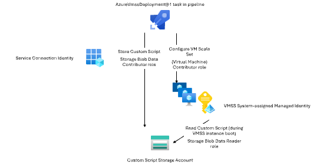

### Azure Classic Service Connections are being retired

Cloud Services is the classic deployment model for Azure, also called Azure Service Manager (ASM). It has been replaced by Azure Resource Manager (ARM) since 2014 and is now [retired](https://azure.microsoft.com/updates?id=cloud-services-retirement-announcement). Therefore, we are removing the ability to create new Azure Classic service connections. Existing Azure Classic service connections won't be removed.

### Managed DevOps Pools is Generally Available

Managed DevOps Pools is an evolution of Azure DevOps Virtual Machine Scale Set agent pools. It provides better pool scalability and reliability, simplifies pool management, and allows you to use the VM images from Microsoft-hosted agents on custom Azure VMs. 

Managed DevOps Pools is now generally available. You can read about Managed DevOps Pools features and the features newly added for GA [here](https://devblogs.microsoft.com/devops/managed-devops-pools-ga/) and [here](https://aka.ms/mdp-docs).


### The AzureVmssDeployment@1, JavaToolInstaller@2, JenkinsDownloadArtifacts@2 task implement secret-less access to Azure storage accounts

The AzureVmssDeployment, JavaToolInstaller, JenkinsDownloadArtifacts tasks can be configured to use Azure Storage:

```yaml
- task: AzureVmssDeployment@1
  inputs:
    (required properties)
    customScriptsStorageAccount: <storage account>
- task: JavaToolInstaller@2
  inputs:
    (required properties)
    jdkSourceOption: 'AzureStorage'
    azureResourceManagerEndpoint: <service connection>
    azureStorageAccountName: <storage account>
- task: JenkinsDownloadArtifacts@2
  inputs:
    (required properties)
    artifactProvider: 'azureStorage'
    ConnectedServiceNameARM: <service connection>
    storageAccountName: <storage account>
```

New task versions have been created that now use Azure RBAC instead of storage account key/sas. The new tasks require the [Storage Blob Data Contributor](/azure/role-based-access-control/built-in-roles/storage#storage-blob-data-contributor) role to be assigned to the identity of the service connection configured. 

You will need to assign the appropriate RBAC role for the task to be able to access the Azure Storage Account. See [Assign an Azure role for access to blob data](/azure/storage/blobs/assign-azure-role-data-access?tabs=portal).

The AzureVmssDeployment@1 task needs additional RBAC roles configured to access the storage account configured in `customScriptsStorageAccount`:



1. Service Connection: [Contributor](/azure/role-based-access-control/built-in-roles/privileged#contributor) or [Virtual Machine Contributor](/azure/role-based-access-control/built-in-roles/compute#virtual-machine-contributor) permission on the Virtual Machine Scale Set
2. Service Connection: [Storage Blob Data Contributor](/azure/role-based-access-control/built-in-roles/storage#storage-blob-data-contributor) on the storage account that holds the custom script
3. Virtual Machine Scale Set System-assigned Managed Identity: [Storage Blob Data Reader](/azure/role-based-access-control/built-in-roles/storage#storage-blob-data-reader) on the storage account that holds the custom script
